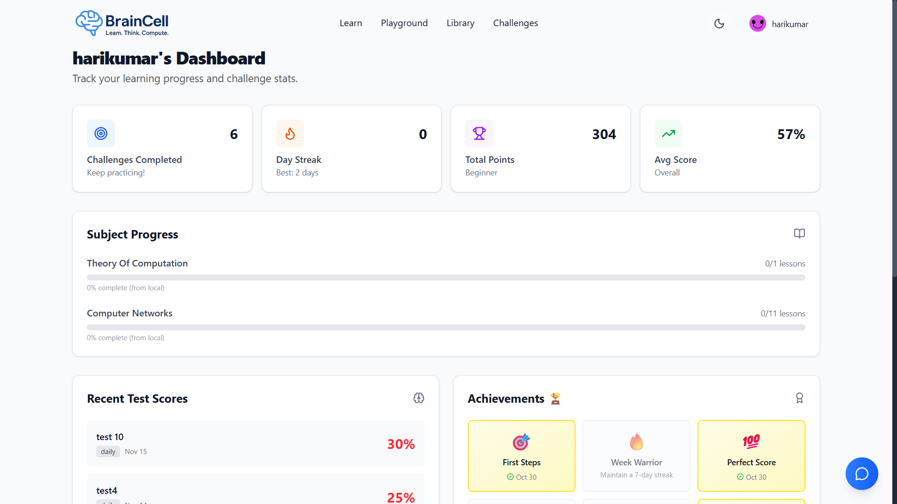
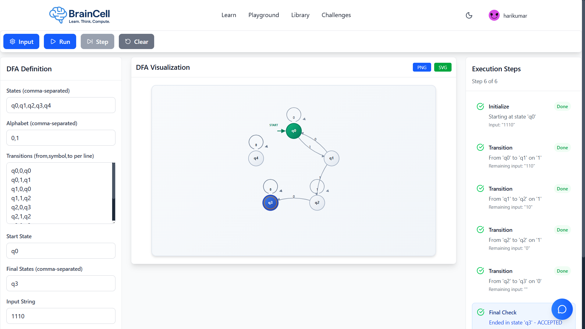
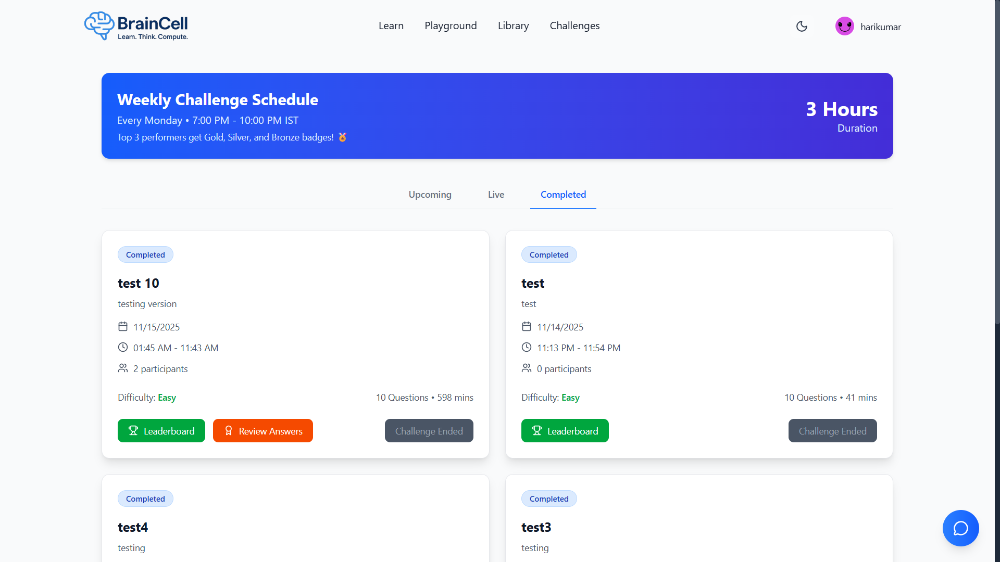

# 🚀 BrainCell - Subject Learning Platform

[](https://opensource.org/licenses/MIT)
[](https://reactjs.org/)
[](https://nodejs.org/)
[](https://www.mongodb.com/)

> **Empowering Engineering Minds Through Interactive Learning** 🌟

<a name="table-of-contents"></a>
## 📋 Table of Contents

- [🌟 Introduction](#introduction)
- [🛠️ Tech Stack](#tech-stack)
- [✨ Key Features](#key-features)
- [🎮 Live Demo](#live-demo)
- [📸 Screenshots](#screenshots)
- [🚀 Quick Start](#quick-start)
- [🎯 Use Cases](#use-cases)
- [🏗️ Project Structure](#project-structure)
- [🗺️ Roadmap](#roadmap)
- [🤝 Contributing](#contributing)
- [📞 Contact](#contact)
- [📜 License](#license)
- [🙏 Credits](#credits)

<a name="introduction"></a>
## 🌟 Introduction

Welcome to **BrainCell**, the ultimate learning platform revolutionizing how engineering students master complex subjects! 🎓

BrainCell is a cutting-edge, full-stack web application designed to transform engineering education through immersive, interactive experiences. Whether you're unraveling the mysteries of computer science with automata theory simulations, diving into electrical engineering circuits, or exploring mechanical design principles, BrainCell provides a comprehensive ecosystem for accelerated learning.

### 🎯 What Makes BrainCell Special?

- **🎮 Interactive Simulations**: Hands-on playgrounds for automata, Turing machines, and more
- **📚 Structured Learning Paths**: Organized subjects with progressive lessons and assessments
- **👥 Role-Based Ecosystem**: Tailored experiences for students, instructors, and administrators
- **🤖 AI-Powered Assistance**: Integrated chatbot for instant help and guidance
- **📊 Advanced Analytics**: Detailed progress tracking and performance insights
- **🌐 Modern Architecture**: Built with the latest web technologies for optimal performance

Built with modern web technologies and deployed on Vercel, BrainCell ensures a seamless, responsive experience across all devices. Join thousands of engineering students who are already accelerating their learning journey with BrainCell! 🚀


<a name="tech-stack"></a>
## 🛠️ Tech Stack


### Frontend Technologies

| Technology | Description |
|------------|-------------|
| **React** | Component-based UI library for building interfaces |
| **Vite** | Fast build tool and development server |
| **Tailwind CSS** | Utility-first CSS framework for styling |
| **React Router** | Declarative routing for React applications |
| **Axios** | Promise-based HTTP client for API requests |
| **Chart.js** | Simple yet flexible JavaScript charting library |
| **Cytoscape** | Graph theory library for visualization |
| **D3.js** | Data visualization library for interactive graphics |


### Backend Technologies

| Technology | Description |
|------------|-------------|
| **Node.js** | Server-side JavaScript runtime environment |
| **Express.js** | Fast, unopinionated web framework for Node.js |
| **MongoDB** | NoSQL document database for flexible data storage |
| **JWT** | JSON Web Tokens for secure authentication |
| **bcrypt** | Password hashing library for security |
| **Cloudinary** | Cloud-based media management platform |
| **Multer** | Middleware for handling file uploads |


### Deployment & Development Tools

| Technology | Description |
|------------|-------------|
| **Vite** | Fast build tool and development server |
| **Vercel** | Cloud platform for serverless deployment |
| **ESLint** | Tool for identifying and fixing code issues |


<a name="key-features"></a>
## ✨ Key Features

BrainCell packs powerful features to create an unparalleled learning experience:

### 🔐 **Authentication & Security**
- **Multi-Role System**: Dedicated interfaces for Students, Instructors, and Administrators
- **JWT-Based Security**: Secure authentication with encrypted passwords
- **Role-Based Access Control**: Granular permissions for different user types

### 📚 **Learning Management**
- **Comprehensive Subject Library**: Engineering subjects from Computer Science to Mechanical Engineering
- **Structured Lesson Plans**: Progressive learning with videos, text, and interactive elements
- **Progress Tracking**: Detailed analytics on lesson completion and time spent
- **Bookmarking & Notes**: Save important concepts and add personal annotations

### 🎯 **Interactive Challenges**
- **Diverse Question Types**: Multiple choice, coding problems, and practical exercises
- **Real-Time Scoring**: Instant feedback on challenge submissions
- **Leaderboards**: Compete with peers and track rankings
- **Challenge Analytics**: Performance metrics and improvement suggestions

### 📖 **Resource Hub**
- **Digital Library**: PDFs, templates, cheat sheets, and reference materials
- **File Upload System**: Cloud-based storage with Cloudinary integration
- **Search & Filter**: Easy discovery of relevant resources
- **Version Control**: Track updates to shared documents

### 🎮 **Advanced Playgrounds**
- **Automata Simulations**: DFA, NFA, Turing Machines, PDA, and Chomsky Hierarchy
- **Conversion Tools**: Regex to DFA, Mealy to Moore transformations
- **Interactive Visualizations**: Graph-based representations with Cytoscape and D3.js
- **Step-by-Step Execution**: Debug and understand complex algorithms

### 🤖 **AI Assistance**
- **Intelligent Chatbot**: Context-aware help for subject-related queries
- **24/7 Support**: Instant answers to common questions
- **Personalized Recommendations**: Suggested resources based on learning patterns

### 📊 **Analytics Dashboard**
- **Student Metrics**: Completion rates, time analytics, and skill assessments
- **Instructor Insights**: Class performance, student engagement, and content effectiveness
- **Admin Overview**: System usage, user management, and platform health
- **Visual Reports**: Charts and graphs powered by Chart.js

### 🎥 **Multimedia Content**
- **Video Integration**: YouTube embeds for lectures and tutorials
- **FAQ System**: Community-driven knowledge base
- **Rich Text Editor**: Create engaging content with formatting options

### 📱 **User Experience**
- **Responsive Design**: Seamless experience on desktop, tablet, and mobile
- **Dark/Light Themes**: Customizable interface with theme switching
- **Intuitive Navigation**: Clean UI built with Tailwind CSS and Lucide icons
- **Accessibility**: WCAG-compliant design for inclusive learning

<a name="live-demo"></a>
## Live Demo

Experience BrainCell in action! Visit our live demo at [https://braincell-campus.vercel.app](https://braincell-campus.vercel.app) to explore the platform without signing up.

<a name="screenshots"></a>
## Screenshots

### Student Dashboard


### Automata Playground


### Challenge Interface



<a name="quick-start"></a>
## 🚀 Quick Start

Follow these steps to get BrainCell running locally in minutes! ⚡

### 📋 Prerequisites

Before you begin, ensure you have the following installed:

- **Node.js** (v16 or higher) - [Download here](https://nodejs.org/)
- **MongoDB** (v4.4 or higher) - [Installation guide](https://docs.mongodb.com/manual/installation/)
- **Git** - [Download here](https://git-scm.com/)
- **npm** or **yarn** package manager

### 🛠️ Installation & Setup

1. **Clone the Repository** 📥
   ```bash
   git clone https://github.com/Durgaprasad2408/BrainCell.git
   cd braincell-learning-platform
   ```

2. **Backend Setup** 🔧
   ```bash
   cd backend

   # Install dependencies
   npm install

   # Create environment file
   cp .env.example .env

   # Edit .env with your configuration
   # Required: MONGODB_URI, JWT_SECRET, CLOUDINARY_CLOUD_NAME, etc.

   # Seed initial data (optional)
   npm run seed:subjects

   # Start development server
   npm run dev
   ```
   The backend will run on [http://localhost:5000](http://localhost:5000) 🚀

3. **Frontend Setup** 🎨
   ```bash
   # Open new terminal and navigate to frontend
   cd ../frontend

   # Install dependencies
   npm install

   # Start development server
   npm run dev
   ```
   The frontend will run on [http://localhost:5173](http://localhost:5173) 🌐

4. **Access BrainCell** 🎉
   - **Student Portal**: [http://localhost:5173](http://localhost:5173)
   - **API Documentation**: [http://localhost:5000/api/health](http://localhost:5000/api/health)

### 🔧 Environment Configuration

Create a `.env` file in the `backend` directory with the following variables:

```env
# Database
MONGODB_URI=mongodb://localhost:27017/braincell
NODE_ENV=development

# Authentication
JWT_SECRET=your-super-secure-jwt-secret-key-here
JWT_EXPIRE=7d

# Cloudinary (for file uploads)
CLOUDINARY_CLOUD_NAME=your-cloud-name
CLOUDINARY_API_KEY=your-api-key
CLOUDINARY_API_SECRET=your-api-secret

# Frontend URL
CLIENT_URL=http://localhost:5173
```

### 🐛 Troubleshooting

**Common Issues & Solutions:**

- **MongoDB Connection Error**: Ensure MongoDB is running (`mongod` command)
- **Port Already in Use**: Change ports in `.env` or kill processes on ports 5000/5173
- **CORS Issues**: Verify `CLIENT_URL` in backend `.env` matches frontend URL
- **Build Errors**: Clear node_modules and reinstall: `rm -rf node_modules && npm install`

### 📚 Additional Resources

- [Backend API Documentation](backend/README.md)
- [Frontend Development Guide](frontend/README.md)
- [Contributing Guidelines](CONTRIBUTING.md)

<a name="use-cases"></a>
## 🎯 Use Cases

BrainCell serves diverse stakeholders in the engineering education ecosystem:

### 👨‍🎓 **For Students**
- **Self-Paced Learning**: Master complex engineering concepts at your own speed
- **Interactive Practice**: Hone skills with hands-on simulations and challenges
- **Progress Monitoring**: Track achievements and identify areas for improvement
- **Peer Competition**: Engage in leaderboards and collaborative learning
- **Career Preparation**: Build portfolios with completed projects and certifications

### 👨‍🏫 **For Instructors**
- **Content Creation**: Design comprehensive courses with multimedia elements
- **Student Assessment**: Create and grade challenges with automated scoring
- **Performance Analytics**: Monitor class progress and individual student metrics
- **Resource Management**: Upload and organize teaching materials efficiently
- **Community Building**: Foster engagement through interactive discussions

### 👨‍💼 **For Administrators**
- **User Management**: Oversee accounts, roles, and permissions across the platform
- **System Monitoring**: Track usage patterns and platform performance
- **Content Moderation**: Ensure quality and appropriateness of shared resources
- **Analytics & Reporting**: Generate insights for institutional decision-making
- **Scalability Planning**: Monitor growth and plan infrastructure needs

### 🏫 **For Educational Institutions**
- **Unified Learning Platform**: Centralize engineering education across departments
- **Curriculum Integration**: Align platform content with academic standards
- **Cost-Effective Scaling**: Deploy for large student populations affordably
- **Data-Driven Insights**: Make informed decisions based on learning analytics
- **Industry Partnerships**: Showcase student achievements to potential employers

<a name="project-structure"></a>
## Project Structure

```
braincell-learning-platform/
├── backend/                 # Node.js/Express server
│   ├── config/              # Database and cloud configurations
│   ├── controllers/         # API route handlers
│   ├── middleware/          # Authentication and upload middleware
│   ├── models/              # MongoDB schemas
│   ├── routes/              # API endpoints
│   ├── scripts/             # Utility scripts (e.g., seeding data)
│   └── server.js            # Main server file
├── frontend/                # React/Vite client
│   ├── public/              # Static assets
│   ├── src/
│   │   ├── components/      # Reusable UI components
│   │   ├── contexts/        # React contexts (Auth, Theme)
│   │   ├── pages/           # Page components
│   │   ├── utils/           # Helper functions and utilities
│   │   └── App.jsx          # Main app component
│   └── vite.config.js       # Vite configuration
└── README.md                # Project documentation
```

<a name="roadmap"></a>
## 🗺️ Roadmap

BrainCell is evolving rapidly! Here's our development roadmap with planned features and improvements:

### 🚀 Q1 2025 - Enhanced Learning Experience
- [ ] **Gamification System**: Badges, achievements, and reward points
- [ ] **Advanced Quiz Builder**: Drag-and-drop question creation with multimedia support
- [ ] **Real-time Collaboration**: Live coding sessions and group problem-solving
- [ ] **Mobile Responsiveness**: Optimized mobile experience with PWA features

### 📚 Q2 2025 - Content Expansion
- [ ] **Expanded Subject Library**: Mechanical Engineering, Electrical Engineering, Civil Engineering modules
- [ ] **Video Lecture Series**: Integrated video content with interactive timestamps
- [ ] **Resource Marketplace**: User-generated content sharing and rating system
- [ ] **Multi-language Support**: Localization for global accessibility

### 🤖 Q3 2025 - AI & Analytics
- [ ] **AI Tutor Enhancement**: Machine learning-powered personalized learning paths
- [ ] **Predictive Analytics**: Early warning system for at-risk students
- [ ] **Automated Assessment**: AI-driven grading for coding challenges
- [ ] **Learning Path Recommendations**: Smart content suggestions based on performance

### 🌐 Q4 2025 - Platform Integration
- [ ] **LMS Integration**: Seamless connection with Moodle, Canvas, and Blackboard
- [ ] **API Ecosystem**: Third-party integrations for tools like GitHub, VS Code
- [ ] **Enterprise Features**: SSO, bulk user management, and custom branding
- [ ] **Offline Mode**: Downloadable content packages for offline learning

### 📱 2026 - Mobile & Global Expansion
- [ ] **Native Mobile Apps**: iOS and Android applications with native features
- [ ] **Cross-Platform Sync**: Seamless data synchronization across devices
- [ ] **Global Community**: Multi-region deployment with localized content
- [ ] **VR/AR Integration**: Immersive learning experiences for complex concepts

### 🔮 Future Vision
- **Metaverse Learning**: Virtual classrooms and collaborative spaces
- **Blockchain Credentials**: Decentralized skill verification and certifications
- **AI Research Integration**: Cutting-edge research directly accessible to students

**Stay tuned for updates!** Follow our [GitHub repository](https://github.com/Durgaprasad2408/BrainCell) for the latest developments.

<a name="contributing"></a>
## Contributing

We welcome contributions from the community! To get started:

1. Fork the repository.
2. Create a feature branch: `git checkout -b feature/your-feature-name`.
3. Make your changes and commit: `git commit -m 'Add some feature'`.
4. Push to the branch: `git push origin feature/your-feature-name`.
5. Open a pull request.

Please read our [contributing guidelines](CONTRIBUTING.md) for more details on code standards and submission processes.

<a name="contact"></a>
## 📞 Contact

Get in touch with the BrainCell team! We're always excited to hear from fellow educators, developers, and learners.

### 👥 Development Team

- **Lead Developer**: Durga Prasad Pandiripalli (Full-Stack Engineer)
- **UI/UX Designer**: [Team Member Name]
- **Backend Specialist**: [Team Member Name]
- **Frontend Developer**: [Team Member Name]

#### **Durga Prasad Pandiripalli - Lead Developer & Architect**
- **Email**: durgaprasad.p@outlook.in
- **LinkedIn**: [linkedin.com/in/durga-prasad-pandiripalli-5b97ab264](https://www.linkedin.com/in/durga-prasad-pandiripalli-5b97ab264)
- **GitHub**: [github.com/Durgaprasad2408](https://github.com/Durgaprasad2408)
- **Portfolio**: [durgaprasadpandiripalli.me](https://www.durgaprasadpandiripalli.me)


### 🌐 **Project Links**
- **Website**: [https://braincell-campus.vercel.app](https://braincell-campus.vercel.app)
- **GitHub Repository**: [https://github.com/Durgaprasad2408/BrainCell](https://github.com/Durgaprasad2408/BrainCell)

### 💬 Support

- **Bug Reports**: [GitHub Issues](https://github.com/Durgaprasad2408/BrainCell/issues)
- **Feature Requests**: [GitHub Discussions](https://github.com/Durgaprasad2408/BrainCell/discussions)
- **General Inquiries**: durgaprasad.p@outlook.in


<a name="license"></a>
## 📜 License

This project is licensed under the MIT License. See the [LICENSE](LICENSE) file for details.

<a name="credits"></a>
## 🙏 Credits & Acknowledgments

BrainCell wouldn't be possible without the incredible support of our community and the open-source ecosystem:

### 👥 **Core Development Team**
- **Durga Prasad Pandiripalli**: Lead Developer & Architect
- **Open Source Contributors**: Thank you to all who have contributed code, bug reports, and feature suggestions

### 🛠️ **Technology Partners**
- **React Community**: For the amazing frontend framework that powers our interactive UI
- **Node.js & Express**: The robust backend foundation
- **MongoDB**: Flexible and scalable data storage
- **Vercel**: Seamless deployment and hosting
- **Cloudinary**: Reliable media management

### 🎨 **Design & UX**
- **Tailwind CSS**: Utility-first styling that keeps our UI clean and responsive
- **Lucide Icons**: Beautiful, consistent iconography
- **Chart.js & Cytoscape**: Powerful visualization libraries

### 📚 **Educational Inspiration**
- **Computer Science Educators**: Pioneers in automata theory and algorithm visualization
- **Engineering Community**: For pushing the boundaries of interactive learning
- **Students Worldwide**: Your feedback drives our continuous improvement

### 🌟 **Special Thanks**
To all beta testers, early adopters, and the amazing engineering education community for believing in our vision!

---

## 🎓 Ready to Transform Your Learning?

**Join BrainCell today and experience the future of engineering education!** 🚀

- 🌐 Visit [braincell-campus.vercel.app](https://braincell-campus.vercel.app)
- 📧 Contact us at durgaprasad.p@outlook.in
- 🐛 Report issues on [GitHub](https://github.com/Durgaprasad2408/BrainCell/issues)

*Happy Learning! 🎯*
